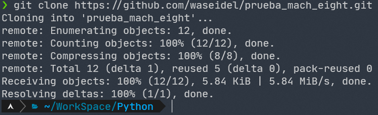
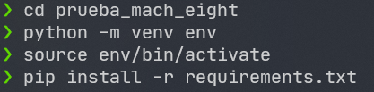
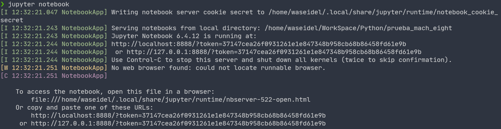
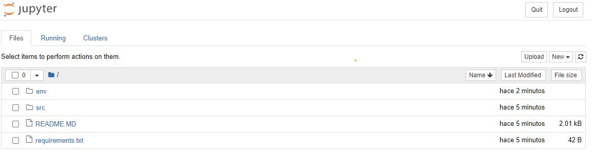
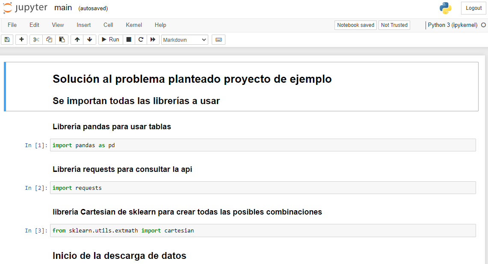
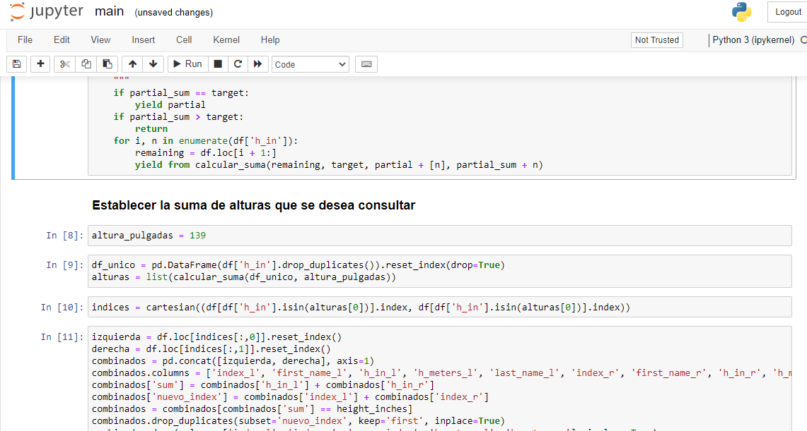
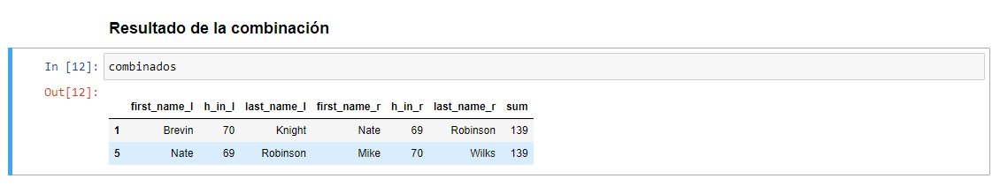

# Mach Eight Sample Project

El proyecto consiste en crear una funcion que busca los jugadores de la NBA
basado en la entrada del usuario. Los datos originalmente vienen de
[aquí](https://www.openintro.org/data/index.php?data=nba_heights). Para facilidad
de implementación, hemos servido los datos en formato json [aquí](https://mach-eight.uc.r.appspot.com/).

La tarea es crear una aplicación que solicite al usuario que ingrese una entrada
numérica. La aplicación descarga los datos del sitio web arriba mencionado
(https://mach-eight.uc.r.appspot.com) e imprime todas las parejas de jugadores
cuyas alturas en pulgadas (in), al ser sumadas, corresponden al número de entrada.
Si no se encuentran coincidencias, la aplicación imprime "No se encontraron coincidencias"

Ejemplo de salida de la siguiente manera:
```
> app 139

- Brevin Knight         Nate Robinson
- Nate Robinson         Mike Wilks
```

El algoritmo para encontrar los pares debe ser más rápido que O(n^2). Debe
funcionar correctamente en todos los casos de borde. Esta _no_ es una prueba a
libro cerrado. Lo invitamos a contactarnos con cualquier duda que tenga.


## Evaluación

Todos los candidatos que presenten un algoritmo que es eficiente y correcto
pasarán al siguiente paso del proceso de selección. Definimos "eficiente" como
más rápido que O(n^2). Definimos "correcto" como imprimir la respuesta correcta
para todas las entradas posibles. Todas las tareas que no impriman la respuesta
correcta por la entrada del ejemplo mencionado arriba no serán tenidas en cuenta.

Si siente que nos quiere impresionar yendo más allá, nos impresionan las
buenas pruebas unitarias y el código limpio. No nos interesa mucho el conocimiento de un
sistema específico como react o django. Puede crear una aplicación compleja de
una sola pagina con bonitos gráficos si quiere, pero no va a mejorar la
probabilidad de pasar. Hemos recibido tareas que han pasado nuestros filtors que
contienen poco menos de 30 líneas de python.

# Solución del proyecto

## Pasos para ejecutar la solución planteada
### 1. Clonar el repositorio
```bash
git clone https://github.com/waseidel/prueba_mach_eight.git
```


### 2. Instalar las dependencias
```bash
cd prueba_mach_eight
python -m venv env
source env/bin/activate
pip install -r requirements
```

En caso de no tener instalado virtualenv para ejecutar ```venv``` se debe instalar usando ```pip install virtualenv```

En windows el reemplazar el comando ```source env/bin/activate``` por ```.\env\Scripts\activate```



### 3. Ejecutar jupyter notebook
```bash
jupyter notebook
```


Esto abre automaticamente el navegador con el notebook, de no ser así copiar la url que se indica en la parte inferior ```http://localhost:8888/?token=XXXXX```

Se visualiza lo siguiente


Se debe entrar en la carpeta src y ejecutar el archivo main.ipynb


Ya se puede empezar a ejecutar el notebook y en la celda 8 digitar la suma de alturas que se espera


En la última celda se visualiza un dataframe con la respuesta esperada
